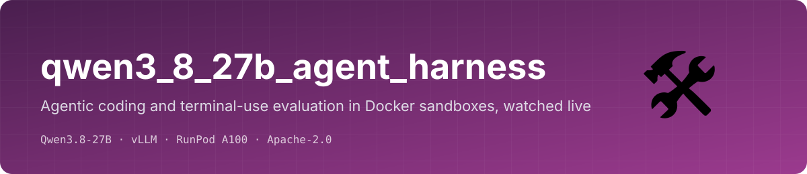
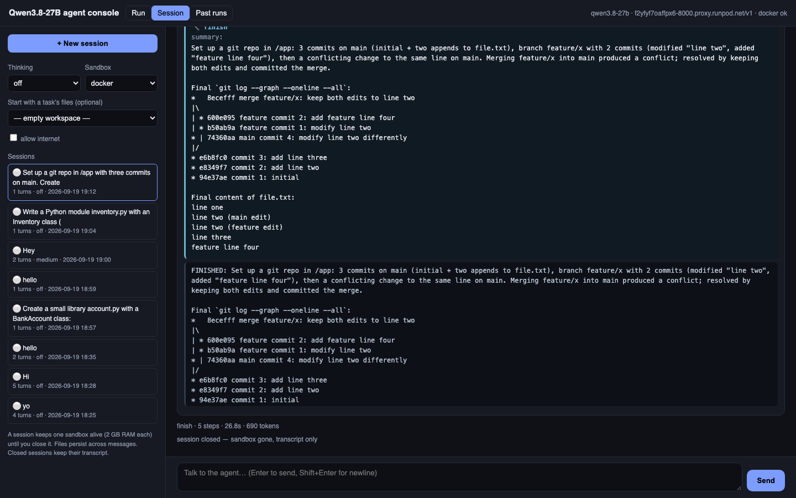
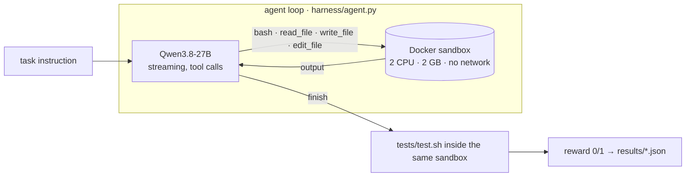
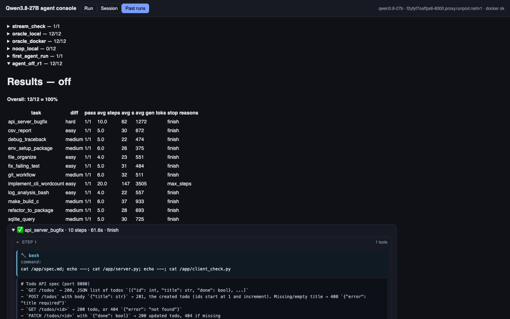

<p align="center"></p>

<p align="center">
  
  
  
  
  
</p>

**Watch an open model work as a coding agent, step by step, inside a sandbox.** A tool-using agent loop (bash, read, write, edit,
finish), Docker isolation, 12 graded coding / terminal tasks in Terminal-Bench style, and a console where you can watch a run live
or chat with the agent in a persistent workspace. Built for [Qwen3.8-27B on vLLM](https://github.com/Harpreet221295/qwen3_8_27b_vllm_server);
works with any OpenAI-compatible endpoint that supports tool calls.

<p align="center"></p>
<p align="center"><sub>Session tab: a persistent sandbox you talk to. Here the model set up a git repo, created a conflict, resolved it and reported the real log.</sub></p>

## How it works



- **Tool outputs are truncated** to keep context bounded; **cwd persists** across bash calls; a fallback parser catches raw `<tool_call>` text.
- **Sandboxes**: `docker` (default; Colima or Docker Desktop), `e2b` (cloud microVMs), `local` (no isolation, debugging only, guarded by a confirmation).
- **Tasks** mirror the Harbor / Terminal-Bench layout: `instruction.md`, `environment/`, `tests/test.sh` writing `/logs/verifier/reward.txt`, `solution/solve.sh`.
  Validate with `--oracle` (must pass) and `--noop` (must fail).

## The console

<p align="center"></p>

| Tab | What it does |
|---|---|
| **Run** | one task in a fresh sandbox, graded; or a custom instruction, ungraded. Live: thinking (gold), file contents and commands typing out as the model writes them, tool outputs, step timings, then the grade. |
| **Session** | a persistent sandbox you chat with. Questions get text; work gets tools; files persist across messages. |
| **Past runs** | every batch run with full transcripts. |

## Tasks and first result (Qwen3.8-27B, thinking off, 1 attempt, Docker)

| Task | Difficulty | Tests | Steps | Time |
|---|---|---|---|---|
| fix_failing_test | easy | fix 3 bugs until pytest is green | 5 | 31 s |
| implement_cli_wordcount | easy | build a `wc` clone with flags and error handling | 20 | 147 s |
| csv_report | easy | messy CSV → JSON report | 5 | 30 s |
| log_analysis_bash | easy | top IPs, 5xx paths, summary, shell tools | 4 | 22 s |
| file_organize | easy | sort files by type, drop empties, manifest | 4 | 23 s |
| git_workflow | medium | ignore, branch, commit, merge, tag | 6 | 32 s |
| sqlite_query | medium | explore schema, answer 3 questions | 5 | 30 s |
| env_setup_package | medium | install a vendored package offline, run script | 6 | 26 s |
| refactor_to_package | medium | split a monolith into a package, tests still pass | 5 | 28 s |
| debug_traceback | medium | fix a parser crash on real configs | 5 | 22 s |
| make_build_c | medium | fix Makefile + C source, `-Wall -Werror` | 6 | 37 s |
| api_server_bugfix | hard | 6 bugs in a stdlib HTTP API, checked by a client | 10 | 62 s |

**12/12.** Zero malformed tool calls. Full transcripts and notes: [RESULTS.md](RESULTS.md). The set is too easy to separate strong models; harder, longer tasks and pass@3 are next.

## Quick start

```bash
brew install colima docker && colima start --cpu 4 --memory 8 --disk 40      # Apple Silicon; Docker Desktop also works
git clone https://github.com/Harpreet221295/qwen3_8_27b_agent_harness && cd qwen3_8_27b_agent_harness
python3 -m venv .venv && .venv/bin/pip install -r requirements.txt
cp .env.example .env                                                          # QWEN_BASE_URL, QWEN_API_KEY
docker build -t qwen-sandbox:latest -f docker/Dockerfile.sandbox docker/

.venv/bin/python run_eval.py --oracle              # graders sanity: 12/12
.venv/bin/python run_eval.py --repeats 3           # the model, pass@3
.venv/bin/python -m uvicorn ui.app:app --port 7861 # the console
```

## Docs
[docs/agent_console.md](docs/agent_console.md) · [docs/SANDBOX_SETUP.md](docs/SANDBOX_SETUP.md) · [docs/TERMINAL_BENCH.md](docs/TERMINAL_BENCH.md) (official Terminal-Bench 2 via Harbor) · [RESULTS.md](RESULTS.md)

## Related
[qwen3_8_27b_vllm_server](https://github.com/Harpreet221295/qwen3_8_27b_vllm_server) (deployment) · [qwen3_8_27b_workloads](https://github.com/Harpreet221295/qwen3_8_27b_workloads) (chat playground, capability suites, τ²-bench console)

## License
Apache-2.0
